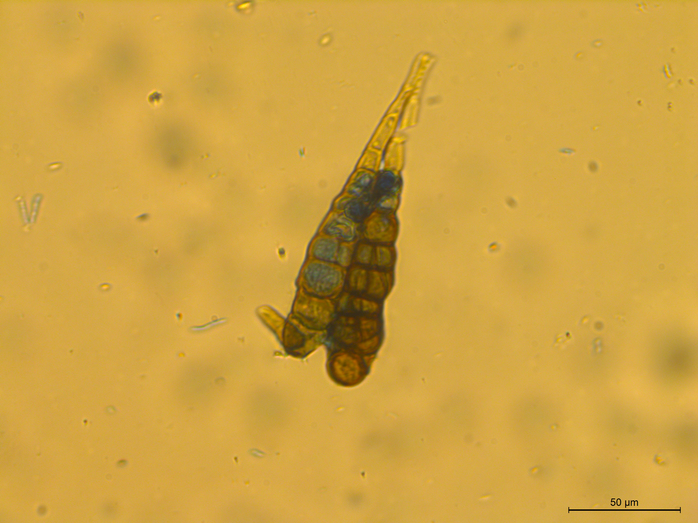
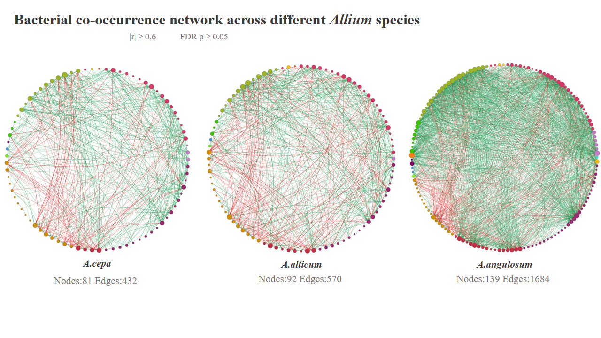

# Laboratory Gallery

A visual collection of research activities, laboratory work, field studies, training programmes, scientific events, and collaborations from the Roy Plant–Microbiome Laboratory.

---

## Research & Laboratory Work

::: {.gallery-grid}

::: {.gallery-item}

<strong>Plant Pathology Research</strong>
Research on plant–pathogen interactions and disease biology.

:::

<strong>Callose Deposition and Plant Defence Responses</strong>
Microscopic visualization of callose deposition associated with plant defence responses.

::: {.gallery-item}

<strong>Fungal Spore Germination</strong>
Microscopic observation of fungal spore germination during laboratory studies.

:::

<strong>Hydrogen Peroxide Accumulation and Oxidative Defence Response</strong>
DAB-based visualization of hydrogen peroxide accumulation associated with plant defence responses.

::: {.gallery-item}

<strong>Nanoparticle Research</strong>

Evaluation of nanoparticle-associated antibacterial activity and characterization of Cu₂O-based materials.

:::

::: {.gallery-item}

<strong>Metagenomic Analysis</strong>
Computational exploration of microbial communities and their functional potential.

:::

:::

---

## Field & Crop Research

<strong>Field and Crop Research</strong>

Our research extends from laboratory-based plant–microbe studies to crop-level investigations,
including disease management, rhizosphere microbiome analysis, and sustainable agricultural applications.

---

<strong>Student Research Training and Laboratory Activities</strong>
Hands-on research training and laboratory activities supporting student scientific development.

---

## Collaborations & Events

::: {.gallery-grid}

::: {.gallery-item}

<strong>International Research Training & Collaboration</strong>

Research training and scientific exchange through international collaboration at the University of Helsinki.

:::

:::

---

## Advanced Research Imaging

::: {.gallery-grid}

::: {.gallery-item}

<strong>Transmission Electron Microscopy</strong>
High-resolution microscopy supporting nanoparticle characterization and materials research.

:::

:::