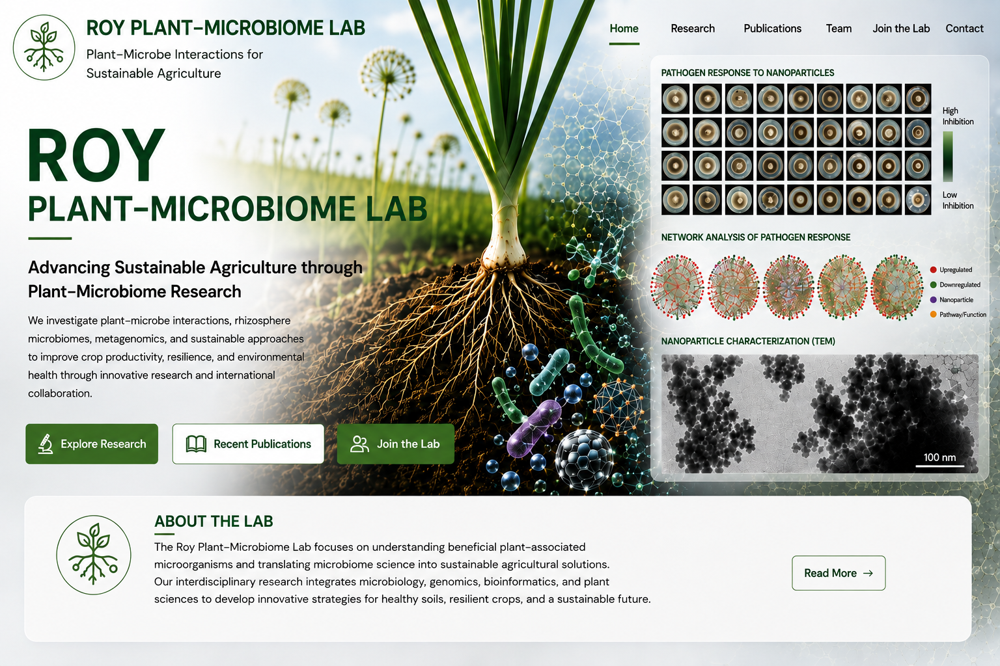

# Roy Plant–Microbiome Lab

### Advancing Sustainable Agriculture through Plant–Microbiome Research

We investigate plant–microbe interactions, rhizosphere microbiomes, metagenomics, plant pathology, nanotechnology, and innovative biological strategies to improve crop productivity, resilience, and sustainable agriculture.

<a href="research.html" class="hero-btn primary">
🔬 Explore Research
</a>

<a href="publications.html" class="hero-btn secondary">
📚 Publications
</a>

<a href="join.html" class="hero-btn primary">
👨‍🔬 Join the Lab
</a>

---

## About the Lab

The **Roy Plant–Microbiome Lab** is dedicated to understanding the complex interactions between plants and their associated microbial communities. Our interdisciplinary research combines microbiology, plant pathology, metagenomics, nanotechnology, molecular biology, and bioinformatics to develop innovative solutions for sustainable agriculture, crop health, and environmental resilience.

[**Learn More About the Lab →**](about.html)

---

## Research Impact

Our research contributes to sustainable agriculture through high-quality publications, funded projects, international collaborations, and the training of future scientists.

::: {.stats-grid}

::: {.stat-card}

### 📄

## 14+

Publications

:::

::: {.stat-card}

### 🎓

## 3

Research Scholars

:::

::: {.stat-card}

### 🔬

## 2

Active Projects

:::

::: {.stat-card}

### 🌍

## 4

Collaborating Institutions

:::

:::

---

## Featured Research

Our laboratory addresses fundamental and applied questions in plant biology by integrating microbiology, metagenomics, nanotechnology, and bioinformatics to develop sustainable agricultural solutions.

::: {.research-grid}

::: {.research-card}

### 🧅 Wild *Allium* Rhizosphere Microbiome

Understanding how domestication shapes the rhizosphere microbiome of wild and cultivated *Allium* species.

**Research Areas**

- Rhizosphere microbiome
- Wild *Allium*
- Metagenomics
- Sustainable agriculture

[Learn More →](research.html)

:::

::: {.research-card}

### 🧪 Nanotechnology for Plant Disease Management

Developing environmentally friendly nanoparticle-based strategies for sustainable disease management.

**Research Areas**

- Plant pathology
- Nanotechnology
- Disease management
- Environmental safety

[Learn More →](research.html)

:::

::: {.research-card}

### 🧬 Plant–Microbiome Interactions

Investigating beneficial microorganisms and translating microbiome science into sustainable crop production.

**Research Areas**

- Plant–microbe interactions
- Bioinformatics
- Multi-omics
- Microbial ecology

[Learn More →](research.html)

:::

:::

---
