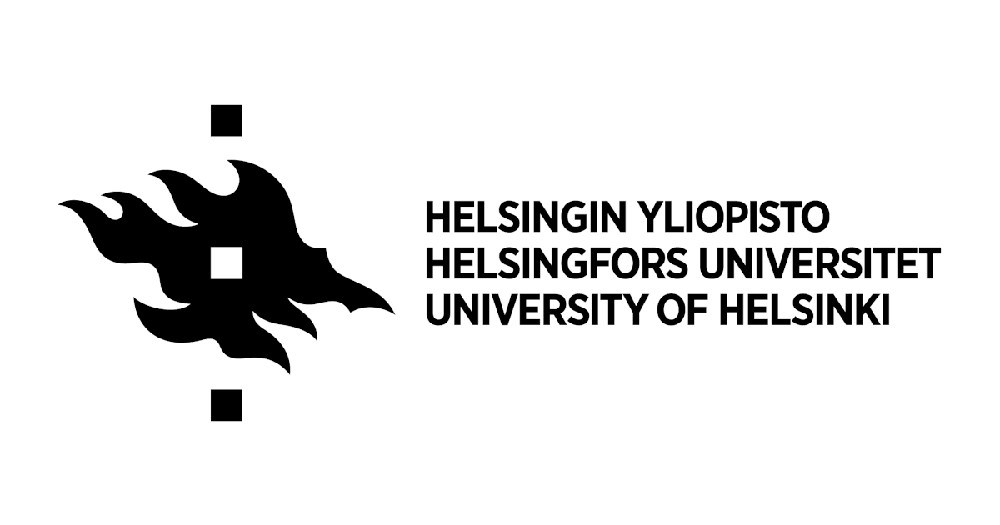
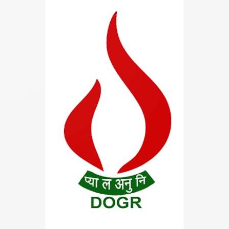
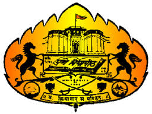
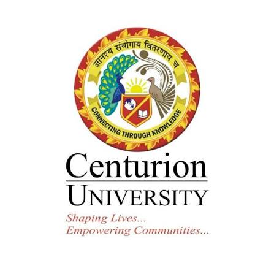

{fig-alt="Roylawar Plant-Microbiome Research Laboratory" width="100%"}

# Roylawar Plant–Microbiome Laboratory

## Advancing Sustainable Agriculture through Plant–Microbiome Research

Welcome to the **Roylawar Plant–Microbiome Research Laboratory**, where we explore the fascinating interactions between plants and microorganisms to develop sustainable solutions for agriculture. Our research integrates microbiology, molecular biology, ecology, bioinformatics, and biotechnology to improve crop productivity and resilience.

## Research Focus

::: {.research-grid}

::: {.research-card}

### 🌱 Rhizosphere Microbiome

Understanding the diversity and function of microbial communities associated with plant roots.

:::

::: {.research-card}

### 🧬 Plant–Microbe Interactions

Investigating beneficial microbial interactions to improve crop productivity and resilience.

:::

::: {.research-card}

### 🧅 Wild *Allium* Biology

Exploring wild *Allium* species as valuable genetic and microbiome resources.

:::

::: {.research-card}

### 🦠 Metagenomics & Microbial Ecology

Applying next-generation sequencing to characterize complex microbial communities.

:::

::: {.research-card}

### 🧪 Synthetic Microbial Communities

Designing SynComs for sustainable crop production and disease management.

:::

::: {.research-card}

### 🌾 Climate-Resilient Agriculture

Developing microbiome-based strategies for sustainable and climate-resilient farming.

:::

:::

---

## 📊 By the Numbers

::: {.stats-grid}

::: {.stat-card}

### 👨‍🎓

## 3

Research Scholars

:::

::: {.stat-card}

### 📄

## 14+

Publications

:::

::: {.stat-card}

### 🌍

## 4

Collaborating Institutions

:::

::: {.stat-card}

### 🔬

## 2

Active Projects

:::

:::

---

## 🌍 Research Collaborations

::: {.collab-grid}

::: {.collab-card}

{height=80px}

### University of Helsinki

**International Research Partner**

Department of Microbiology

Helsinki, Finland

:::

::: {.collab-card}

{height=80px}

### ICAR – Directorate of Onion and Garlic Research

**Research & Training Partner**

Rajgurunagar, Pune, Maharashtra, India

:::

::: {.collab-card}

{height=80px}

### Savitribai Phule Pune University

**Academic Partner**

Pune, Maharashtra, India

:::

::: {.collab-card}

{height=80px}

### Centurion University of Technology and Management

**Research Collaborator**

Odisha, India

:::

:::

---

## 🔬 Current Research

- Characterization of rhizosphere microbiomes of wild *Allium* species
- Microbial ecology using next-generation sequencing
- Synthetic microbial community development (SynComs)
- Biofertilizer–microbiome interactions
- Climate-resilient agriculture
- Biological control of plant diseases using beneficial microbes

---

## 📢 Latest Highlights

- International collaborations in Finland and India
- Multi-omics research on plant microbiomes
- Development of microbial consortia for sustainable agriculture
- Student training in advanced molecular biology and bioinformatics
- International Ph.D. student exchange programmes
- Ongoing collaborations with ICAR-DOGR and University of Helsinki

---

## 🔗 Explore the Website

- 📖 Learn about our research programmes
- 👨‍🔬 Meet our research team
- 📚 Browse publications
- 📢 Read laboratory news
- 🌱 Explore opportunities to join the laboratory
- 📬 Contact us for collaborations and research enquiries